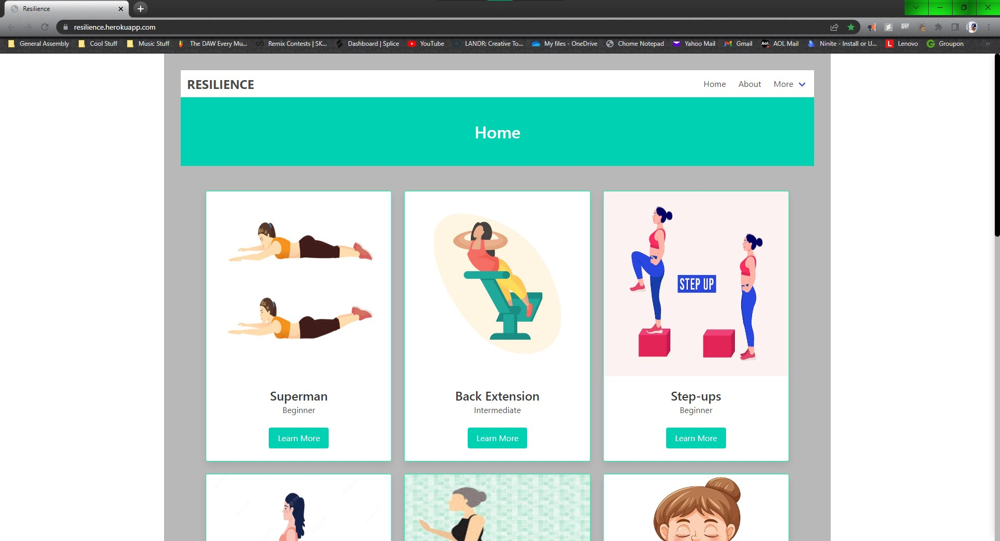

# Project-4-Resilience
Resilience is an app designed for people who have limitations physically.  Whether it may be a disability, injury, or just a lack of motivation, Resilience is here to help you get back on track.  Resilience is a fitness app that allows users to view exercises and share there experiences with the community.  Users can also comment and give them feedback about the exercises. 

## Route Table

|       **URL**           | **REST Route** | **HTTP Verb** | **CRUD Action** |   **EJS View(s)**         | **Created Yet?**  |
| ---------------         | -------------- | ------------- | --------------- | ------------------------  | ----------------- |
| /                       | N/A            | GET           | read            | HomePage.jsx              | YES               |
| /about                  | N/A            | GET           | read            | AboutPage.jsx             | YES               |
| /exercise/:id           | show           | GET           | read            | DetailsPage.jsx           | YES               |
| /exercise/comment/:id   | Create         | POST          | create          | DetailsPage.jsx           | YES               |
| /exercise/comment/:id   | Show           | GET           | read            | DetailsPage.jsx           | YES               |
| /exercise/comment/:id   | update         | PUT           | update          | DetailsPage.jsx           | YES               |
| /exercise/comment/:id   | destroy	       | DELETE	       | delete		       | DetailsPage.jsx           | YES               |

## Installation Instructions:
If you would like to run this app locally, please follow these steps:
- Fork and clone this repository
- Initialize NPM
- install node.js, express.js, mongoose, Bulma and configure .json package
- creat .env and use PORT = 3000
- 'npm run backend' to start backend; 'npm run frontend' to start frontend

## Technologies Used:
### Languages: 
- React/Vite
- JavaScript
- Express
- Node.js
- Mongoose/MongoDB
- JSX
- Postman
- HTML
- CSS
- Bulma*

### Workflow/ Project Management:
- Trello
- Figma
- Github
- Visual Studio Code Live Share
- Heroku

## User Stories:
1. As a user with arthritis, I want to use this fitness app to find exercises that are low-impact and won't exacerbate my joint pain.

2. As a user with a bad back, I want to use this fitness app to find exercises that will help me build strength and flexibility in my back muscles without putting too much strain on my sensitive  area.

3. As a user with mobility issues, I want to use this fitness app to find exercises that are accessible and can be done from a seated or lying-down position.

4. As a user with balance issues, I want to use this fitness app to find exercises that can improve my balance and stability. I need the app to have a variety of exercises that focus on balance, including ones that challenge me to stand on one leg, shift my weight from side to side, and move in different directions. 

## Wireframes:
I used [figma.com](https://www.figma.com/file/7wBGaHA0XFB88nwxCfr6TY/project-4?node-id=0%3A1&t=PPAq1DrSF3dJu7bN-1) to make my wireframe.

- [Homepage](frontend/src/assets/wireframe/wireframe-home.jpg)
- [Details Page](frontend/src/assets/wireframe/wireframe-details.jpg)
- [Search](frontend/src/assets/wireframe/wireframe-search.jpg) - this is a future enhancement 

## Launch the App!
[Click to Checkout Resilience!](https://resilience.herokuapp.com)

## Unsolved Problems/ Major Hurdles:
- **Major Hurdles:** - I had a hard time figuring out how to get the comments to show up and implement CRUD on the details page.  With help, I was able to get it to work.  I was also having technical issues with the VITE update where is was giving me errors or wasn't recognizing defined veriables.  This issue was also fixed.

- **Unsolved Problems:** - I would have like to implement JWT and have a user profile page where users can see all the exercises they've saved and all the comments they've made.

## Next Steps:
- **Future enhancement one:** - us API or add more exercises to the database
- **Future enhancement two:** - add a search page or search bar so users can search for exercises by name.
- **Future enhancement three:** - add a user profile page so users can see all the exercises they've saved and all the comments they've made.
- **Future enhancement four:** - sort exercises by difficulty level, body part, or equipment needed.
- **Future enhancement five:** - add the disclaimer to a modal that pops up when the user first visits the app.